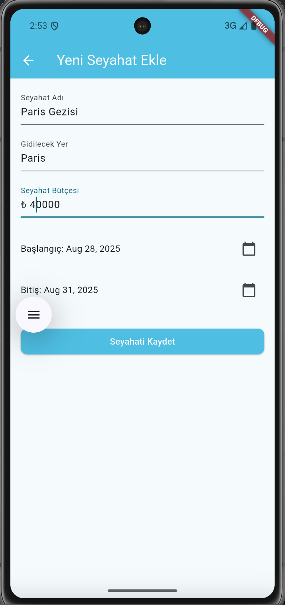

# travel_assistant_app

## Genel Bakış

**travel_assistant_app**, seyahat planlama, bütçe yönetimi ve görev takibini tek bir yerde toplayan bir Flutter uygulamasıdır. Yeni seyahatler oluşturabilir, destinasyon ve tarih belirleyebilir, bütçe planı yapabilir, masrafları takip edebilir ve seyahatle ilgili görevlerinizi yönetebilirsiniz. Uygulama, güvenli erişim için kullanıcı kimlik doğrulaması (Firebase Auth) kullanır. Gidilecek yer için anlık hava durumunu görebileceğiniz entegrasyon mevcuttur.

## Özellikler

- **Kimlik Doğrulama**: E-posta/şifre ile giriş/çıkış
- **Seyahat Yönetimi**: Seyahat Adı, Gidilecek Yer, Başlangıç/Bitiş Tarihi
- **Bütçe Planlama**: Seyahat bazında toplam bütçe belirleme
- **Masraf Takibi**
- **Görev Yönetimi**: “Vize başvurusu”, “Otel rezervasyonu” gibi yapılacaklar listesi; tamamlandı/aktif durumları
- **Hava Durumu**: Destinasyona özel anlık hava durumu sorgulama
- **Basit ve Sezgisel Arayüz**

## Ekran Görüntüleri

Ekran görüntüsü alma önerileri:

- iOS Simülatör: Command + S (veya Menü: File → Save Screen Shot)
- Android Emulator: “Take screenshot” aracı (sağ panel) veya `adb exec-out screencap -p > shot.png`
- Fiziksel cihaz: Yerleşik ekran görüntüsü kısayolları; dosyaları `docs/screenshots/` içine taşıyın

## KurulumHa

1. Depoyu klonlayın.
2. Bağımlılıkları kurun: `flutter pub get`
3. Firebase yapılandırmasını tamamlayın (iOS/Android için `google-services` dosyaları ekli):
   - Android: `android/app/google-services.json`
   - iOS: `ios/Runner/GoogleService-Info.plist` (yoksa Firebase konsolundan indirin)
4. Uygulamayı başlatın: `flutter run`

## Yapılandırma

- Hava durumu servisi için `lib/weather_service.dart` kullanılır.

## Kullanım Akışları

1. **Giriş Yap**  
   E-posta/şifrenizle giriş yapın.
   
   Örnek Giriş Bilgileri:  
   - **User Name:** nuray54@gmail.com  
   - **Password:** sntrk5417

2. **Seyahat Oluştur**  
   Seyahat adı - Gidilecek Yer - Seyahat Bütçesi - Başlangıç Tarihi - Bitiş Tarihi bilgileri girilerek seyahat oluşturabilirsiniz.

3. **Bütçe Planla**  
   Seyahat için toplam bütçeyi seyahat oluşturma aşamasında girilir (örn. 15.000 TRY). Bütçe ilerlemesi detay ekranında çubuk/renk ile gösterilir.

4. **Harcama Ekle**  
   Gezi detayında sağ üst köşedeki simgeye tıklanır. Harcama Başlığı ve Miktar girilir. Masraflar arka planda toplanarak bütçeden düşülecektir ve seyahat detayında bütçe durumunu göreceksiniz.

5. **Görevleri Yönet**  
   Seyahat detayında Yapılacaklar listenizi oluşturun (örn. “Araç kiralama”), işaretleyerek tamamlayın.

6. **Hava Durumunu Gör**  
   Gidilecek yer için anlık hava durumu bilgisini görüntüleyin.

## Teknik Notlar

- Flutter ve Firebase entegrasyonu mevcuttur (kimlik doğrulama). Gerektiğinde Cloud Firestore/Realtime Database ile kalıcı veri eklenebilir.
- Durum yönetimi ve veri katmanı ihtiyaçlarına göre genişletilebilir (Provider, Riverpod, Bloc vb.).
- Test ve dağıtım süreçleri için GitHub Actions veya benzeri CI/CD akışları eklenebilir.

## Katkıda Bulunma

Pull request'ler memnuniyetle karşılanır! Büyük değişiklikler için lütfen önce bir konu (issue) açarak tartışma başlatın.

## Lisans

Bu proje MIT Lisansı ile lisanslanmıştır.

## Kaynaklar

- [Lab: İlk Flutter uygulamanızı yazın](https://docs.flutter.dev/get-started/codelab)
- [Cookbook: Faydalı Flutter örnekleri](https://docs.flutter.dev/cookbook)
- [Flutter Dokümantasyonu](https://docs.flutter.dev/)
